# RipForge

**[ripforge.org](https://ripforge.org)** · A modern, self-hosted disc ripping solution with smart identification and media server integration.

## Features

- **Smart Disc Identification** - Parses disc labels + matches runtime against Radarr/TMDB
- **Fake Playlist Detection** - Detects Disney-style protection with dozens of similar-length tracks, uses TMDB runtime to find the real movie
- **Auto-Retry Backup Mode** - For Blu-rays, if direct rip fails (copy protection), auto-retries by decrypting full disc first
- **Filename Sanitization** - Handles colons and special characters in titles (Star Wars: → Star Wars -)
- **TV Show Auto-Detection** - Detects episode-length tracks and rips all episodes automatically
- **Hands-Free Mode** - Insert disc, walk away - auto-detects movies vs TV, rips everything
- **Review Queue** - Failed identifications go to a review folder for manual matching with IMDB/TMDB verification links
- **Editable Title** - Scan disc, verify/edit title, then rip with confidence
- **Auto-Scan on Insert** - Detects disc insertion and automatically scans
- **Auto-Rip Countdown** - 20-second countdown after scan, auto-starts rip (cancellable)
- **Uncertain ID Handling** - Email notification only if you don't correct the title
- **Resilient Ripping** - Job state persists to disk, survives service restarts mid-rip
- **Live Progress** - File size display during rip (e.g., "2.1 / 5.0 GB"), progress bar
- **Smart Recovery** - Detects incomplete rips (<90% complete) and won't auto-process them
- **Silent Failure Detection** - Catches MakeMKV "success" with no actual progress (disc read issues)
- **Failure Tracking** - Dedicated tab logs failed rips with kernel I/O errors for troubleshooting
- **Media Server Integration** - Radarr, Sonarr, Overseerr, Plex
- **Real-time Progress** - Checklist UI shows each step with spinner animations
- **Hardware Dashboard** - CPU, RAM (with DDR type/speed), storage (SSD/HDD/Pool + individual drives), optical drive, network interface type, live memory updates
- **Email Notifications** - Rip complete, errors, and weekly recap with movie posters and disc type badges
- **Plex User Import** - Auto-import Plex users as email recipients with one click
- **SendGrid Support** - Optional SendGrid integration for better Gmail deliverability, with opt-out sync
- **Cancellation Detection** - Distinguishes manual stops from actual failures in activity log
- **Activity Logging** - Detailed activity log with identification method tracking
- **Rip Statistics** - Average rip times by disc type, weekly/daily counts in sidebar
- **IMDB/TMDB Links** - Quick verification links when identification is uncertain
- **Auto-Detection** - Scans for Docker containers and imports API keys
- **Toast Notifications** - Non-intrusive notifications for all actions
- **Systemd Service** - Runs on boot, survives reboots
- **Auto-Reset on Eject** - UI resets to ready state when disc is ejected
- **Stop Drive Button** - Cancel any operation, kill MakeMKV, and eject disc
- **Version Check** - Auto-check for updates with green/yellow/orange status dot
- **One-Click Update** - Pull latest from GitHub, install dependencies, restart service with countdown
- **Rip Mode Settings** - Smart (tries direct, falls back to backup), Always Backup, or Direct Only
- **Compact Progress UI** - Rip step shows substeps inline: `◐ Direct 45%` or `✗ Direct → ◐ Backup 6%`
- **Digest Reset** - Clear the "recently added" list for testing weekly digests
- **Library Export** - Generate PDF of your movie/TV library with optional posters, email to admin
- **Ned Integration** - Auto-detects Ned monitoring agent if installed

## Dashboard


## Requirements

- Linux (tested on Ubuntu 24.04)
- Python 3.10+
- MakeMKV
- Optical drive (Blu-ray or DVD)
- msmtp or SendGrid API key (optional, for email notifications)

## Copy Protection & Decryption

### DVD (CSS Decryption)

For CSS-protected DVDs, install libdvdcss:

```bash
sudo apt install libdvd-pkg
sudo dpkg-reconfigure libdvd-pkg
```

This downloads, compiles, and installs libdvdcss. Without it, CSS-encrypted DVDs will fail with "Read of scrambled sector without authentication" errors.

### Blu-ray (AACS/BD+ Decryption)

MakeMKV handles Blu-ray decryption natively but requires a license key. A free beta key is available:

1. Get the current key from: https://forum.makemkv.com/forum/viewtopic.php?f=5&t=1053
2. Register it:
   ```bash
   mkdir -p ~/.MakeMKV
   echo 'app_Key = "T-xxxxx..."' > ~/.MakeMKV/settings.conf
   ```

> **Note:** The beta key expires monthly. Bookmark the forum link and update when rips start failing.

### LibreDrive Mode

For best Blu-ray compatibility (especially protected discs like Star Wars), use a drive that supports LibreDrive mode. Check with:

```bash
makemkvcon info disc:0 2>&1 | grep -i "libredrive"
```

If you see `Using LibreDrive mode`, your drive has native disc access bypassing firmware restrictions.

### Advanced Copy Protection Handling

RipForge includes two features for handling problematic discs:

**Fake Playlist Detection** - Disney and other studios use discs with dozens of nearly identical-length tracks to confuse ripping software:
- Track 0: 2:05:32
- Track 1: 2:05:31 ← Real movie
- Track 2: 2:05:33
- ...dozens more fake playlists

RipForge compares track durations against the official TMDB runtime (from Radarr identification) and selects the track closest to the actual movie length. You'll see "fake playlists detected" in the scan results when this happens.

**Auto-Retry via Backup (Blu-ray only)** - When direct ripping fails on Blu-rays (copy protection, read errors, silent failures), RipForge can automatically retry using a backup-first approach:

1. **Direct rip fails** → Logs "Retrying via backup method..."
2. **Backup disc** → MakeMKV decrypts the entire disc to a temp folder
3. **Rip from backup** → Extracts the movie from the decrypted backup
4. **Cleanup** → Backup folder deleted after successful rip

This is enabled by default (`backup_fallback: true`) and handles most problematic Blu-ray discs automatically. The backup approach is slower but more reliable for protected content.

> **DVD Note:** DVDs always use direct extraction. MakeMKV's backup command creates ISO/UDF images for DVDs rather than a usable VIDEO_TS folder structure, so RipForge bypasses backup mode entirely for DVDs.

## Quick Start

```bash
# Clone the repository
git clone https://github.com/paul-tastic/ripforge.git
cd ripforge

# Run setup script
./scripts/setup.sh

# Or manual setup:
sudo add-apt-repository ppa:heyarje/makemkv-beta
sudo apt update
sudo apt install makemkv-bin makemkv-oss
sudo usermod -aG cdrom $USER

python3 -m venv venv
source venv/bin/activate
pip install -r requirements.txt

python run.py
```

Open http://localhost:8081

## Install as Service

```bash
sudo cp ripforge.service /etc/systemd/system/
sudo systemctl daemon-reload
sudo systemctl enable --now ripforge
```

## Workflow

### Standard Mode (hands_free: false)
1. **Insert disc** - Auto-detected and scan begins automatically
2. **Identification** - Smart ID parses label + matches runtime against TMDB
3. **Review** - Title shown with confidence badge (HIGH/MEDIUM/LOW) and expected file size
   - **HIGH confidence**: 20-second countdown starts automatically
   - **LOW confidence**: Waits for manual review (email only sent if you don't correct it)
4. **Edit if needed** - Fix title or use IMDB button to search
5. **Rip** - Button shows exactly what will be ripped: `Rip "Movie Title (Year)"`
6. **Progress** - Live file size (e.g., "2.1 / 5.0 GB"), checklist shows each step
7. **Resilient** - Service restart mid-rip? No problem - recovers and continues
8. **Eject** - UI auto-resets to ready state, waiting for next disc

### Hands-Free Mode (hands_free: true)
1. **Insert disc** - Auto-detected, quick scan determines movie vs TV
2. **Auto-detect** - Movies rip main feature; TV shows rip all episode tracks
3. **Rip** - Progress shown with file size, checklist updates in real-time
4. **Identification** - After rip completes, uses ffprobe to get actual file runtime
5. **Smart Match** - Searches Radarr/Sonarr/TMDB with actual runtime for better accuracy
6. **Move** - Files moved to final location with identified title
7. **Eject** - UI auto-resets, ready for next disc

Hands-free mode is ideal for batch ripping - just swap discs without touching the keyboard. Works with both movies and TV shows.

### Review Queue

When automatic identification fails (confidence below threshold), rips are moved to a review folder instead of being stuck:

1. **Review Queue** - Failed IDs appear in the "Needs Review" section on the dashboard
2. **Search** - Enter the correct title to search Radarr/TMDB
3. **Verify** - Click IMDB/TMDB links to confirm the match before applying
4. **Apply** - One click moves the file to your library with proper naming
5. **Delete** - Remove unwanted rips directly from the queue

The review queue ensures nothing gets lost while giving you full control over uncertain identifications.

## Configuration

Settings stored in `config/settings.yaml`. Edit via web UI or directly.

### Ripping Settings

```yaml
ripping:
  min_length: 2700              # 45 min - skip short tracks
  main_feature_only: true       # Only rip longest track (movies)
  skip_transcode: true          # Keep original quality
  rip_mode: smart               # smart, always_backup, or direct_only
  auto_scan_on_insert: true     # Auto-scan when disc inserted
  auto_rip: true                # Auto-start after countdown
  auto_rip_delay: 20            # Countdown seconds
  hands_free: false             # Skip scan/preview, rip immediately, identify after
  confidence_threshold: 75      # Below this = needs manual review
  notify_uncertain: true        # Email when ID confidence is low
  tv_min_episode_length: 1200   # 20 min - minimum track length for TV detection
```

**Rip Modes (Blu-ray only):**

> **Note:** DVDs always use direct extraction regardless of this setting. MakeMKV's backup mode creates ISO images for DVDs (not a usable folder structure), so direct extraction is used instead.

- **Smart** (recommended) - Tries direct rip first; if it fails, automatically retries with backup method
- **Always Backup** - Always decrypts full disc first, then extracts. Slower but most reliable for protected content
- **Direct Only** - Only attempts direct rip; no fallback if copy protection blocks it

### Rip Mode Flowchart


### DVD vs Blu-ray Handling

```mermaid
flowchart LR
    subgraph DVD["📀 DVD Workflow"]
        direction TB
        D1[Insert DVD] --> D2[Detect CSS Protection]
        D2 --> D3{libdvdcss installed?}
        D3 -->|Yes| D4[Direct Extraction]
        D3 -->|No| D5[❌ Decryption Failed]
        D4 --> D6[✅ MKV Output]
    end

    subgraph BD["💿 Blu-ray Workflow"]
        direction TB
        B1[Insert Blu-ray] --> B2[Detect AACS/BD+]
        B2 --> B3{MakeMKV Key Valid?}
        B3 -->|Yes| B4{LibreDrive?}
        B3 -->|No| B5[❌ Key Expired]
        B4 -->|Yes| B6[Enhanced Decryption]
        B4 -->|No| B7[Standard Decryption]
        B6 --> B8[Apply Rip Mode]
        B7 --> B8
        B8 --> B9[✅ MKV Output]
    end

    style D6 fill:#166534,color:#fff
    style D5 fill:#991b1b,color:#fff
    style B9 fill:#166534,color:#fff
    style B5 fill:#991b1b,color:#fff
```



### Email Notifications

```yaml
notifications:
  email:
    provider: sendgrid    # or "msmtp" for system mail
    sendgrid_api_key: "SG.xxxxx"  # Get free key at sendgrid.com
    recipients:
      - "you@example.com"
    on_complete: true     # Email when rip finishes
    on_error: true        # Email on failures
    weekly_recap: true    # Weekly summary email
```

**Email Providers:**
- **SendGrid (recommended)** - Better Gmail/spam deliverability, 100 free emails/day
- **msmtp** - System mail, requires server configuration

**Setting up SendGrid:**
1. Create free account at [sendgrid.com](https://sendgrid.com)
2. Go to Settings > API Keys > Create API Key
3. Choose "Restricted Access" and enable only "Mail Send"
4. Copy the key (starts with `SG.`) to RipForge's Notifications page

**Plex User Import:**
The Notifications page automatically imports Plex users with their emails. Check the users you want to receive notifications - they're labeled as Owner, Home, or Friend based on their Plex account type.

**Suppression Sync:**
Recipients who unsubscribe, bounce, or report spam are automatically tracked by SendGrid. Click "Sync Opt-outs" on the Notifications page to mark these recipients as opted out locally - they'll show a red "OPTED OUT" badge and be skipped when sending.

Configure all email settings from the **Notifications page** - recipients, event toggles, weekly digest schedule, and email branding. Weekly recap includes movie posters from TMDB, disc type badges (Blu-ray blue / DVD orange), and rip statistics.

### Integrations

| Service | Purpose |
|---------|---------|
| Radarr | Movie identification via TMDB, library management |
| Sonarr | TV show library management |
| Overseerr | Request matching |
| Plex | Media server, library scanning |
| Tautulli | Plex monitoring |

## API Endpoints

| Endpoint | Method | Description |
|----------|--------|-------------|
| `/api/disc/scan-identify` | GET | Scan disc and identify |
| `/api/rip/start` | POST | Start rip (with optional custom_title) |
| `/api/rip/status` | GET | Current rip progress |
| `/api/rip/reset` | POST | Cancel current job |
| `/api/drive/stop` | POST | Stop drive (kill MakeMKV, reset job, eject) |
| `/api/review/queue` | GET | List items in review queue |
| `/api/review/search` | POST | Search for title match |
| `/api/review/apply` | POST | Apply identification and move to library |
| `/api/review/delete` | POST | Delete item from review queue |
| `/api/hardware` | GET | System hardware info |
| `/api/email/test` | POST | Send test email |
| `/api/email/weekly-recap` | POST | Send weekly recap now |
| `/api/email/reset-digest` | POST | Reset digest list (clear recently added) |
| `/api/email/sync-suppressions` | POST | Sync SendGrid opt-outs to local recipients |
| `/api/rip-stats` | GET | Rip statistics (avg time by disc type, counts) |
| `/api/settings` | GET/POST | Configuration |
| `/api/auto-detect` | POST | Scan for services |
| `/api/plex/users` | GET | Get Plex users with emails |
| `/api/newsletter/settings` | GET/POST | Newsletter schedule and recipients |
| `/api/version` | GET | Current version and update check |
| `/api/update` | POST | Pull latest code, install deps, restart service |
| `/api/library/export` | POST | Generate library PDF (movies/shows) |
| `/api/library/exports` | GET | List available export files |
| `/exports/<filename>` | GET | Download export file |

## Project Structure

```
ripforge/
├── app/
│   ├── config.py         # Configuration, hardware detection, Ned detection
│   ├── routes.py         # Web routes and API
│   ├── ripper.py         # MakeMKV wrapper, rip pipeline
│   ├── identify.py       # Smart identification
│   ├── email.py          # Email notifications (SendGrid + msmtp)
│   ├── activity.py       # Activity logging and rip history
│   └── library_export.py # PDF export for movies/shows
├── config/
│   ├── settings.yaml     # Configuration
│   └── current_job.json  # Persisted job state (auto-managed)
├── exports/              # Generated PDF exports
├── logs/
│   ├── activity.log      # Activity log
│   └── rip_history.json  # Rip history for weekly digest
├── static/css/
│   └── style.css
├── templates/
│   ├── index.html         # Dashboard
│   ├── settings.html      # Configuration (integrations, paths, ripping)
│   ├── notifications.html # Email recipients, events, weekly digest
│   ├── history.html       # Rip history
│   └── failures.html      # Failed rip tracking with kernel errors
├── scripts/
│   ├── setup.sh
│   └── setup-udev.sh
├── tests/
│   ├── conftest.py        # Pytest fixtures
│   ├── test_identify.py   # Identification tests
│   ├── test_ripper.py     # Ripper tests
│   └── test_routes.py     # API route tests
├── ripforge.service
└── run.py
```

## Running Tests

RipForge includes a comprehensive test suite using pytest:

```bash
# Install test dependencies
pip install pytest pytest-cov

# Run all tests
pytest tests/ -v

# Run with coverage
pytest tests/ --cov=app --cov-report=term-missing
```

The test suite covers:
- **Identification** - Disc label parsing, media type detection, Radarr/Sonarr search mocking
- **Ripper** - Folder sanitization, job state management, status enums
- **Routes** - API endpoints, Flask app functionality

## Storage Support

Detects and displays:
- **SSD** - Solid state drives
- **HDD** - Hard disk drives
- **Pool** - MergerFS/union filesystem pools

## Disc Label Parsing

Automatically strips:
- Studio prefixes (MARVEL_STUDIOS_, DISNEY_, WARNER_, etc.)
- Region codes (PS, US, UK, EU, etc.)
- Disc numbers (DISC1, D2, etc.)
- Aspect ratios (4X3, 16X9, WS, FS)
- Format codes (NTSC, PAL)

Examples:
- `MARVEL_STUDIOS_GUARDIANS_3` → "Guardians of the Galaxy Vol 3"
- `NACHO_LIBRE_PS` → "Nacho Libre"
- `SCHOOL_OF_ROCK_4X3` → "School of Rock"

## Filename Sanitization

Titles with special characters are automatically sanitized for filesystem safety:

| Character | Replacement |
|-----------|-------------|
| `:` (colon) | ` -` (space-dash) |
| `<>"\|?*` | removed |
| multiple spaces | single space |

Examples:
- `Star Wars: The Rise of Skywalker` → `Star Wars - The Rise of Skywalker`
- `Solo: A Star Wars Story` → `Solo - A Star Wars Story`
- `Mission: Impossible - Fallout` → `Mission - Impossible - Fallout`

Sanitization is applied to:
- Raw rip output folders
- Final movie/TV destination folders
- Output filenames

## Smart Title Matching

Identification uses weighted scoring to find the best match:
- **Exact title match** - Strong signal, prevents sequel confusion
- **Runtime matching** - Compares disc runtime to TMDB data
- **Year proximity** - Prefers closer release years
- **TMDB ID lookup** - Once identified, poster/metadata fetched by ID (not title search)

This prevents issues like "The Transporter" matching "The Transporter Refueled" or "Spider-Man" matching a newer reboot. The TMDB ID lookup ensures posters are always correct even when disc labels are truncated.

## Inspiration

RipForge was inspired by [Automatic Ripping Machine (ARM)](https://github.com/automatic-ripping-machine/automatic-ripping-machine). ARM pioneered automated disc ripping - RipForge builds on that foundation with a different approach to identification and workflow.

## License

MIT License
